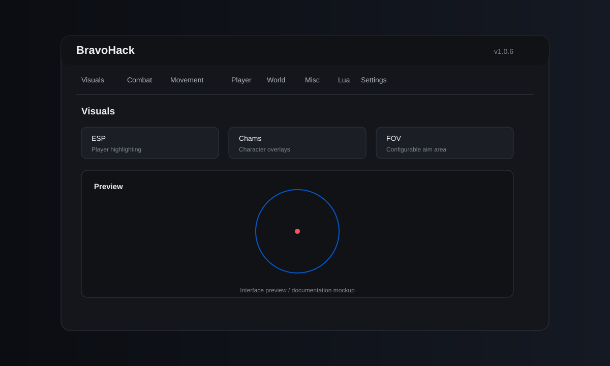
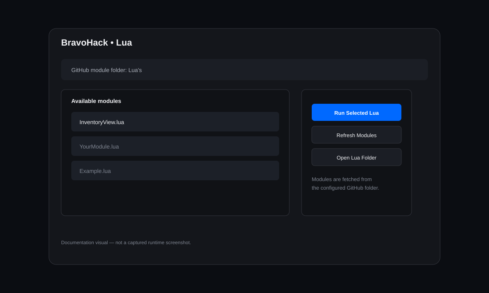
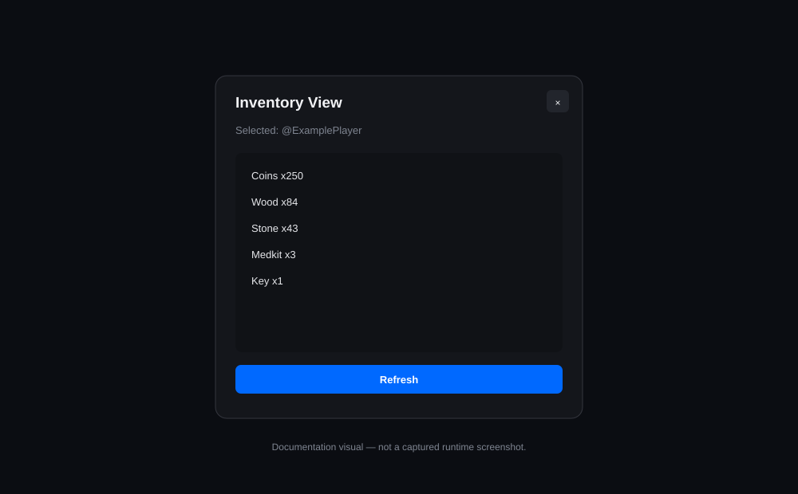

# BravoHack

> **Advanced Roblox client-side utility / development menu**  
> Current release: **v1.0.6**



BravoHack is a modular Roblox Lua menu designed for an executor/client-side environment. The project combines visual tools, combat utilities, movement controls, player/world utilities, persistent configuration, a key gate, and a GitHub-backed Lua module system in one interface.

> **Project note:** BravoHack is intended for use in your own Roblox experience, private testing, or environments where you are authorized to run client-side scripts. Some features depend on the capabilities of the executor being used.

---

## Table of Contents

- [Highlights](#highlights)
- [Interface](#interface)
- [Feature Overview](#feature-overview)
- [Combat](#combat)
- [Visuals](#visuals)
- [Movement](#movement)
- [Player and World](#player-and-world)
- [Persistent Config System](#persistent-config-system)
- [GitHub Lua Modules](#github-lua-modules)
- [Built-in Inventory View](#built-in-inventory-view)
- [Key Gate](#key-gate)
- [Controls](#controls)
- [Repository Structure](#repository-structure)
- [How to Use](#how-to-use)
- [Module API](#module-api)
- [Compatibility Notes](#compatibility-notes)
- [Version](#version)

---

## Highlights

| Area | Included |
|---|---|
| UI | Dark themed tabbed interface |
| Visuals | ESP, Box ESP, healthbars, skeletons, tracers, chams |
| Aiming | Aim Assist, Aimbot, Silent Aim |
| Triggerbot | FOV, delay, cooldown, hit chance and crosshair mode |
| Movement | Infinite Jump, Bunny Hop, Noclip, Fly, Freecam |
| Player | God Mode, ForceField, player selection and protection tools |
| World | Fullbright, fog control, gravity, camera FOV and time controls |
| Utility | Player List, Chat Log, Tool Viewer, Spectate |
| Config | Named JSON configs with persistent executor storage |
| Key system | Key gate + optional remembered key |
| Lua | GitHub module browser and runtime |
| Modules | Built-in `InventoryView.lua` example |

---

## Interface

BravoHack uses a horizontal tab layout so the main categories remain accessible without a large permanent sidebar.


### Main tabs

- **Visuals**
- **Combat**
- **Movement**
- **Player**
- **World**
- **Misc**
- **Lua**
- **Settings**

Each section keeps related controls together while preserving the existing feature system.

---

# Feature Overview

## Visuals

The Visuals section contains player-rendering and targeting visuals.

### ESP

- Player ESP
- Box ESP
- Healthbar
- Skeleton ESP
- Tracers
- Configurable ESP distance

### Chams

- Character chams
- Optional team-color chams
- Protected-player visual handling

### FOV

The aim FOV system is configurable and supports a larger range than earlier versions.

Current default:

`AimFOV = 350`

Current maximum:

`AimFOV = 1000`

---

# Combat

BravoHack currently contains several separate combat/targeting systems.

## Aimbot

The aimbot includes:

- Configurable FOV
- Maximum target distance
- Hit chance
- Smoothness
- Target body part selection
- Optional prediction
- Always-on mode
- Custom key mode
- Team checking
- Wall checking
- FOV visualization

The targeting reference uses the camera viewport center for the crosshair-style targeting flow.

## Aim Assist

Aim Assist provides a separate targeting/smoothing path from the full Aimbot system.

## Triggerbot

Triggerbot supports:

- Configurable FOV
- Configurable delay
- Configurable cooldown
- Hit chance
- Team check
- Wall check
- Target body part
- Always-on mode
- Optional mouse-button requirement
- **Use Crosshair** mode

When Crosshair mode is enabled, Triggerbot uses the center of the camera viewport rather than the physical cursor position.

The click implementation also attempts several executor input APIs so behavior can adapt to different executor environments.

## Silent Aim

The project includes a Silent Aim system with:

- FOV
- Hit chance
- Team check
- Wall check
- Prediction
- Configurable target selection
- Remote filtering for common weapon/projectile-style remote names

Because Silent Aim relies on executor-level metamethod hooking, compatibility depends heavily on the executor.

---

# Movement

Movement utilities include:

- Infinite Jump
- Bunny Hop
- Noclip
- Fly
- Freecam
- Freecam teleport
- WalkSpeed
- JumpPower

Default movement values are preserved through the configuration system.

---

# Player and World

## Player utilities

Available utilities include:

- Player List
- Player selection
- Spectate
- Tool Viewer
- Chat Log
- Protection handling
- God Mode
- ForceField

## World controls

World controls include:

- Fullbright
- Remove Fog
- Gravity
- Time of Day
- Camera FOV
- UI scale

The script stores original environment values where needed so unload/reset operations can restore them.

---

# Persistent Config System

BravoHack contains an executor-side JSON configuration system.

The intended storage layout is:

```text
BravoHack/
├── version.txt
├── key.json
├── settings.json
└── Configs/
    └── Default.json
```

The exact files that exist depend on which options have been used.

## Config features

- Save selected config
- Load selected config
- Delete selected config
- Named configs
- Config list refresh
- Auto Load Selected Config
- Auto Remember Key
- Reset remembered key
- Reset all settings

The configuration system uses executor file APIs such as `makefolder`, `writefile`, `readfile`, `isfile`, and related file operations when available.

---

# GitHub Lua Modules

BravoHack v1.0.6 adds a dedicated **Lua** tab.

The module system lets you place additional `.lua` files directly inside:

```text
Lua's/
```

Then BravoHack can:

1. Query the GitHub folder.
2. Display available `.lua` modules.
3. Select a module.
4. Download the source.
5. Compile it with `loadstring`.
6. Execute it in the current executor environment.



### Add your own module

Create:

```text
Lua's/MyModule.lua
```

Push it to the `main` branch, open BravoHack, go to **Lua**, press **Refresh Lua modules**, select the module and press **Run Selected Lua**.

### Important

Modules execute in the current client/executor environment. Treat repository Lua files as executable code and only run modules you trust.

---

# Built-in Inventory View

The old Inventory View control was moved out of the Misc tab and converted into a standalone GitHub Lua module.

Location:

```text
Lua's/InventoryView.lua
```



The module:

- Uses `BravoHackAPI`
- Reads the currently selected player
- Looks for `Inventory`
- Also supports the project's `Inevtorie` fallback
- Reads direct `IntValue` / `NumberValue` items
- Supports child `Value` objects
- Displays values greater than or equal to 1
- Sorts inventory entries alphabetically
- Includes a Refresh button
- Registers itself with the BravoHack Lua GUI manager

This makes Inventory View independently maintainable instead of adding more feature code to the main script.

---

# Key Gate

BravoHack starts with a client-side key gate.

The gate provides:

- Key input
- Enter/FocusLost handling
- Unlock button
- Get Key button
- Uninject button
- Optional remembered-key behavior

The Get Key flow references the repository's:

```text
Keys.txt
```

The remembered key is stored locally through the executor's file system when the option is enabled.

---

# Controls

| Action | Default |
|---|---|
| Toggle menu | `RightShift` |
| Freecam | `F` |
| Freecam teleport | `RightControl` |
| Triggerbot key | `LeftAlt` |
| Aimbot key | `LeftAlt` |

Feature-specific controls can also be enabled through the corresponding tab settings.

---

# Repository Structure

```text
BravoHack/
├── Main.txt
├── Keys.txt
├── README.md
└── Lua's/
    ├── README.md
    └── InventoryView.lua
```

### Main.txt

The primary BravoHack client script.

### Keys.txt

Repository-side key source used by the key gate flow.

### Lua's/

Extension folder for standalone Lua modules.

### Lua's/README.md

Instructions for creating and running additional modules.

---

# How to Use

## 1. Get the script

Open `Main.txt` from the repository and run it in a compatible Roblox Lua executor.

## 2. Complete the key gate

Enter a valid key from the configured key source, or use the repository's key workflow.

## 3. Open the menu

Press:

```text
RightShift
```

## 4. Select a tab

Choose Visuals, Combat, Movement, Player, World, Misc, Lua or Settings.

## 5. Configure features

Enable the features you need and adjust their sliders/toggles.

## 6. Save configuration

Use **Settings** to save a named configuration if persistent executor-side settings are desired.

## 7. Extend with Lua

Drop a new `.lua` module into:

```text
Lua's/
```

Then refresh the Lua tab and run it.

---

# Module API

Modules can access the shared API exposed by Main.txt.

Typical access:

```lua
local api

if type(getgenv) == "function" then
    api = getgenv().BravoHackAPI
else
    api = _G.BravoHackAPI
end
```

The API exposes the main shared objects/functions used by modules, including:

| API | Purpose |
|---|---|
| `api.State` | Access shared BravoHack state |
| `api.UI` | Access shared UI references |
| `api.Config` | Access configuration functionality |
| `api.Notify` | Send BravoHack notifications |
| `api.RegisterLuaGui` | Register a module GUI |
| `api.CloseLuaGui` | Close a registered module GUI |

A module should verify that `BravoHackAPI` exists before attempting to use it.

---

# Compatibility Notes

BravoHack relies on a client/executor environment for some functionality.

Compatibility can vary depending on executor support for:

- HTTP requests
- `loadstring`
- Clipboard APIs
- File APIs
- Input simulation
- Metamethod hooks
- Remote interception
- Render-step bindings

For example, Triggerbot can try multiple input mechanisms, but the final behavior still depends on what the executor exposes.

Silent Aim is especially executor-dependent because its implementation uses metamethod hooking and remote-call interception.

---

# Development

The project is intentionally modular.

For small extensions, prefer adding a standalone module under:

```text
Lua's/
```

This keeps `Main.txt` focused on the core UI, state, feature systems and shared API.

For larger core changes, update the main script and increment the version header.

Current header:

```lua
-- BravoHack v1.0.6
```

---

# Visual Documentation

The repository includes three lightweight SVG documentation visuals:

- `assets/overview.svg` — main interface overview
- `assets/lua-runner.svg` — GitHub Lua module workflow
- `assets/inventory-view.svg` — Inventory View module

These are documentation mockups rather than captured Roblox screenshots, so they remain portable and version-controlled with the project.

---

# Version

**v1.0.6**

Latest documented changes include:

- Expanded Aimbot FOV
- Camera-center targeting
- Improved Triggerbot targeting
- Triggerbot Crosshair mode
- Additional trigger click fallbacks
- Dedicated Lua tab
- GitHub Lua module browser
- Standalone Inventory View module
- Inventory View moved out of Misc
- Shared `BravoHackAPI`
- Persistent config system
- Remembered-key support

---

## Credits

**BravoBuilds / BravoHack**

Repository:

https://github.com/BravoBuilds/BravoHack

Built as a modular Roblox Lua project with a focus on configurable client-side tooling and extensibility.
